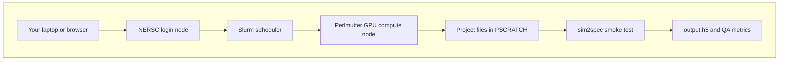
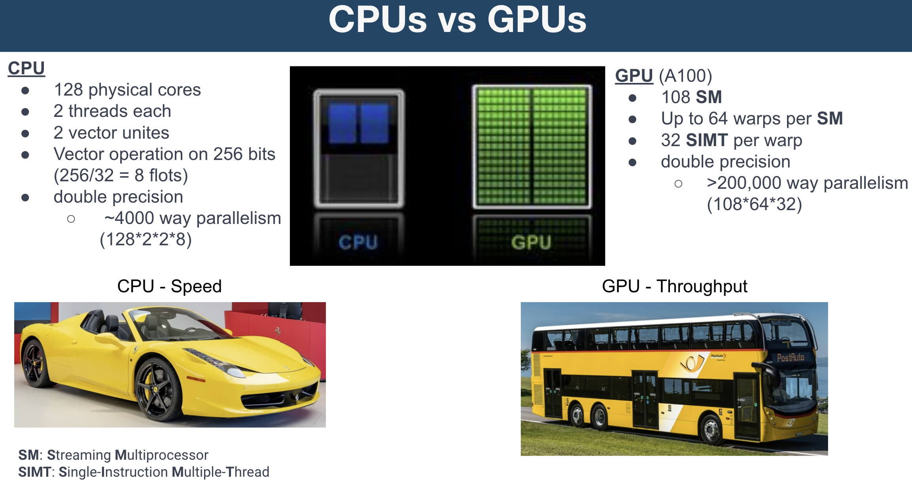

# Project 1: Environment setup, install, and smoke test

Day 1 focuses on getting the full software stack working on Perlmutter. The goal is not yet to do detector analysis, but to make sure the workflow is reproducible and the dependencies are correct. By the end of this day, you should have a working GPU-enabled Python environment, `larnd-sim` installed from source, `sim2spec` installed as a wrapper workflow, and a minimal smoke test that confirms the end-to-end path is functional.

## What you will learn

- How to set up the Perlmutter working directory and Python environment.
- How to install `sim2spec` and `larnd-sim` from source.
- How to validate basic dependencies such as Fire, CuPy, and `larnd-sim`.
- How to run a minimal one-event GPU smoke test and inspect its QA output.

## Big picture

In this project you are not running a simulation on your laptop. You are using your laptop or browser to log in to NERSC, asking Slurm for a GPU compute node, and then running a detector simulation on that compute node.



## CPU and GPU: why GPUs matter here

A CPU is optimized for low-latency execution of many different tasks. A GPU is optimized for high-throughput execution of many similar operations at the same time. Detector simulation has many repeated calculations over tracks, charge deposits, pixels, packets, and waveforms, so it can benefit from GPU-style parallelism.

#### NERSC Perlmutter: CPUs VS GPUs



Source: CPU vs GPU teaching slide provided by the NERSC team.

In simple terms:

- **CPU:** like a fast sports car. It is excellent when one task needs to move quickly and flexibly.
- **GPU:** like a bus. It may not make one passenger arrive faster, but it can move many passengers at once.
- **CUDA:** NVIDIA's programming platform for running work on NVIDIA GPUs.
- **CuPy:** a Python array library that uses CUDA so array operations can run on the GPU.
- **`larnd-sim`:** the detector simulation package used here; it relies on GPU acceleration for realistic workflows.

## Key terms

- **HPC:** high-performance computing; shared computing systems used for large scientific workloads.
- **Perlmutter:** the NERSC supercomputer where this project runs.
- **Login node:** the place where you log in, edit files, clone repositories, and submit jobs. Do not run heavy GPU work here.
- **Compute node:** the place where Slurm runs your simulation after resources are allocated.
- **Slurm:** the scheduler that manages shared compute resources.
- **`salloc`:** requests an interactive allocation, useful when you want a live shell on a compute node.
- **`sbatch`:** submits a batch script, useful when you want the job to run without keeping a terminal open.
- **`srun`:** launches a command on compute resources inside an allocation or from a notebook cell.
- **`$PSCRATCH`:** your scratch storage area for active files and outputs.
- **Python virtual environment:** an isolated Python environment for this project.

## Basic Linux commands used today

These commands are enough for the Day 1 workflow.

| Command | What it does |
| --- | --- |
| `pwd` | Print the directory you are currently in. |
| `ls` | List files in the current directory. |
| `ls -R path` | Recursively list files under a directory. |
| `cd path` | Move into a directory. |
| `mkdir -p path` | Create a directory, including parent directories if needed. |
| `source file.sh` | Run a shell setup file in the current shell. |
| `export NAME=value` | Set an environment variable. |
| `cat file` | Print a file to the terminal. |
| `head file` | Print the first lines of a file. |
| `echo "text"` | Print text or a variable value to the terminal. Useful for checking what a variable holds, for example `echo $WORKDIR`. |
| `find path -name "pattern"` | Search for files matching a name pattern under a directory, for example `find runs/ -name "metrics.json"`. |

## Basic git commands

Git is the version control system used to track code changes, collaborate with others, and clone projects from GitHub. These commands are enough to get started with the Day 1 workflow.

| Command | What it does |
| --- | --- |
| `git clone <url>` | Download a copy of a remote repository to your current directory. |
| `git status` | Show which files have been changed, added, or are untracked since the last commit. |
| `git pull` | Fetch the latest changes from the remote repository and merge them into your current branch. |
| `git log --oneline` | Show a compact history of recent commits with one line per commit. |
| `git branch` | List all local branches. The current branch is marked with `*`. |
| `git checkout -b branch-name` | Create a new branch and switch to it. |
| `git checkout branch-name` | Switch to an existing branch. |
| `git add file` | Stage a changed file so it is included in the next commit. |
| `git commit -m "message"` | Save staged changes as a new commit with a short description. |
| `git push` | Upload your local commits to the remote repository. |
| `git diff` | Show line-by-line differences between your working files and the last commit. |

## Common Slurm commands

| Command | When to use it |
| --- | --- |
| `salloc -C gpu ...` | Request an interactive GPU node. |
| `sbatch scripts/sbatch_day1_smoke.sh` | Submit the smoke test as a batch job. |
| `squeue -u $USER` | Check your queued or running jobs. |
| `sacct -j <JOBID> --format=JobID,JobName,NTasks,NNodes,Elapsed,TotalCPU` | Inspect accounting information for a completed or running job. |
| `scancel <jobid>` | Cancel a job if you submitted the wrong thing. |

## Resources

- [NERSC Documentation](https://docs.nersc.gov/)
- [Running jobs at NERSC](https://docs.nersc.gov/jobs/)
- [Slurm workload manager documentation](https://slurm.schedmd.com/documentation.html)
- [Python virtual environments](https://docs.python.org/3/library/venv.html)
- [NVIDIA CUDA Toolkit documentation](https://docs.nvidia.com/cuda/)
- [CuPy documentation](https://docs.cupy.dev/)
- [DUNE larnd-sim documentation](https://dune.github.io/larnd-sim/larndsim.html)

## Exercise

```bash
# Day 1 environment block
# SKIP THIS IF YOU HAVE ALREADY GIT CLONED, INSTALLED, AND VALIDATED --> JUMP TO SMOKE TEST
```

```bash
# Set up the working area and clone the repo
export MYWORKDIR=$PSCRATCH/HPC_intro
mkdir -p "$MYWORKDIR"
cd "$MYWORKDIR"

# Clone the project from GitHub
git clone https://github.com/madantimalsina/sim2spec.git
cd sim2spec
pwd
```

```bash
# Set up the environment and create the Python virtual environment
source setup.sh
bash install.sh
```

```bash
# Validate the Python environment and the main dependencies
# source setup.sh
source "$venv_name/bin/activate"

python -c "import fire; print('fire ok')"
python -c "import cupy as cp; print(int(cp.arange(10).sum()))"
```

```bash
# Validate larnd-sim install
python -c "import larndsim; print('larndsim ok')"
```

### Smoke test
```bash
# This is a very small end-to-end test to make sure the workflow runs.
export WORKDIR=$PSCRATCH/HPC_intro/sim2spec
export LARNDSIM_DIR=$WORKDIR/larnd-sim
export INPUT_H5=$WORKDIR/input/MiniRun5_1E19_RHC.convert2h5.0000123.EDEPSIM.hdf5
export HDF5_USE_FILE_LOCKING=0
export LARNDSIM_DISABLE_CUPY_MEMPOOL=1
export OUTBASE=$WORKDIR/runs
mkdir -p "$OUTBASE"
```

What the two workflow environment settings do:

- `HDF5_USE_FILE_LOCKING=0` tells HDF5 not to use file locking. This avoids common locking problems on shared HPC filesystems such as scratch filesystems.
- `LARNDSIM_DISABLE_CUPY_MEMPOOL=1` tells `larnd-sim`/CuPy not to keep a reusable GPU memory pool. This can make small training runs easier to debug because GPU memory is released more predictably between runs.

```bash
# NOTE: You will need a NERSC compute allocation and access to Perlmutter.
# For GPU work, request an interactive node or submit a batch job before running simulations.
salloc -C gpu -q interactive -t 00:10:00 -A <your_account> --gpus=1 --ntasks=1 --cpus-per-task=8
```

```bash
# run simulation workflow
sim2spec run \
  --larndsim-dir "$LARNDSIM_DIR" \
  --config 2x2 \
  --input "$INPUT_H5" \
  --outdir "$OUTBASE/day1_smoke" \
  --n-events 1
```

> **Alternatively:** Use [sim2spec_perlmutter_bootcamp.ipynb](JNotebook/sim2spec_perlmutter_bootcamp.ipynb), the interactive notebook for participants who prefer to complete the exercises in Jupyter instead of the terminal. Find the corresponding Project 1 (Day 1) section in the Jupyter notebook.
>
> **Extended/optional:** If you prefer to submit the smoke test as a batch job instead of running it interactively, you can use the provided sbatch script. Make sure to replace `<your_account>` with your NERSC project account, then submit with:
>
> ```bash
> sbatch scripts/sbatch_day1_smoke.sh
> ```
>
> Outputs will be written to `$OUTBASE/day1_smoke_sbatch/run`, QA metrics will be generated automatically, and job logs will appear as `day1_smoke_<jobid>.out` / `.err` in the directory where you submitted the job.

> **Warning for reruns:** `larnd-sim` will not overwrite an existing `output.h5`. If you rerun the smoke test with the same `--outdir` and see an error like `Output file ... already exists`, remove the old output file first or choose a new output directory:
>
> ```bash
> rm "$OUTBASE/day1_smoke/run/output.h5"
> ```

```bash
# Inspect the run directory
ls -R "$OUTBASE/day1_smoke/run"
```

```bash
# Run QA on the smoke test
sim2spec qa --run-dir "$OUTBASE/day1_smoke/run"
```

```bash
# Inspect the QA metrics
cat "$OUTBASE/day1_smoke/run/qa/metrics.json" | head
```

### Example output

Your absolute path and exact numbers may differ, but a successful one-event smoke test should look similar to this:

```text
# Inspect the run directory
<compute-node>:sim2spec > ls -R "$OUTBASE/day1_smoke/run"
$OUTBASE/day1_smoke/run:
command.json  manifest.json  output.h5
```

```text
<compute-node>:sim2spec > sim2spec qa --run-dir "$OUTBASE/day1_smoke/run"
{
  "metrics": {
    "file": "$OUTBASE/day1_smoke/run/output.h5",
    "datasets": [
      "_header",
      "configs",
      "light_dat",
      "light_trig",
      "light_wvfm",
      "light_wvfm_mc_assn",
      "mc_hdr",
      "mc_packets_assn",
      "mc_stack",
      "messages",
      "packets",
      "segments",
      "trajectories",
      "vertices"
    ],
    "n_packets": 39,
    "n_mc_packets_assn": 39,
    "n_light_wvfm": 1,
    "n_light_trig": 1,
    "n_light_dat": 4,
    "timestamp_min": 0,
    "timestamp_max": 1611,
    "adc_min_guess": 0.0,
    "adc_max_guess": 63.0,
    "adc_mean_guess": 21.025641025641026,
    "adc_std_guess": 22.435648350265666
  },
  "plots": {
    "adc_hist": "$OUTBASE/day1_smoke/run/qa/adc_hist.png",
    "timestamp_hist": "$OUTBASE/day1_smoke/run/qa/timestamp_hist.png",
    "light_wvfm0": "$OUTBASE/day1_smoke/run/qa/light_wvfm0.png"
  }
}
```

```text
<compute-node>:sim2spec > cat "$OUTBASE/day1_smoke/run/qa/metrics.json" | head
{
  "adc_max_guess": 63.0,
  "adc_mean_guess": 21.025641025641026,
  "adc_min_guess": 0.0,
  "adc_std_guess": 22.435648350265666,
  "datasets": [
    "_header",
    "configs",
    "light_dat",
    "light_trig",
```


### What to show

- `python -c "import cupy..."` returning `45`
- `validate larnd-sim install`
- optional smoke-test output and `qa/metrics.json`

### Achieved by end of Day

- GPU environment is working
- CUDA and CuPy are correctly installed
- `larnd-sim` and `sim2spec` are installed
- optional first smoke test completes
