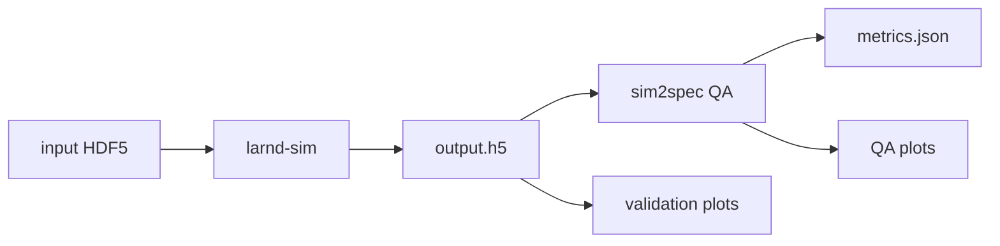

# Project 2: Baseline run and first output validation

Day 2 establishes the first stable baseline simulation and turns it into an interpretable reference run. The objective is to confirm that the pipeline works end to end, starting from the input HDF5 file and producing the expected output artifacts. After the run completes, QA checks summarize packet counts, timing behavior, ADC-related quantities, and basic output plots. The validation plotting helper then reads `output.h5` directly and saves a small set of plots that connect those QA metrics to the physical interpretation of charge timing, event activity, and light-waveform behavior before moving on to parameter sweeps.

## What you will learn

- How to run the first stable baseline simulation.
- How to inspect the run directory, manifest, and QA metrics.
- How to save QA metrics in JSON and CSV formats.
- How to create baseline validation plots from `output.h5` using `plot_validation.py`.

## Physics context: neutrinos and DUNE

A **neutrino** is a very light, electrically neutral elementary particle. Neutrinos interact only rarely with matter, so experiments need intense beams, large detectors, and careful simulation to understand what detector signals should look like.


Source: [Neutrino properties, IN2P3 neutrino history site](https://neutrino-history.in2p3.fr/neutrino-properties/).

**DUNE** is the Deep Underground Neutrino Experiment: an international, U.S.-hosted long-baseline neutrino experiment with more than 2000 scientists and engineers from over 200 institutions in 36 countries and 7 U.S. DOE national laboratories. DUNE will use an intense neutrino beam from Fermilab, a high-rate near detector, and massive liquid-argon far detector modules located nearly a mile underground in South Dakota.


Source: DUNE long-baseline experiment concept, [arXiv:2002.02967](https://doi.org/10.48550/arXiv.2002.02967).

DUNE physics goals include:

- measuring CP violation in the lepton sector, connected to the question of why matter dominates over antimatter
- determining neutrino mass ordering and mixing parameters, which describe how neutrinos transform among flavors (`nu_e`, `nu_mu`, `nu_tau`)
- detecting neutrinos from supernovae
- searching for proton decay and physics beyond the Standard Model

## From simulation output to QA

Day 2 is where the simulation output becomes something you can inspect. The basic workflow is:



## Key terms for Day 2

- **HDF5 file:** a file format designed for large structured datasets. In this project, both the input and simulation output are HDF5 files.
- **Detector simulation output:** the simulated detector response after particles pass through the detector model.
- **Packet:** a unit of simulated detector readout data, similar to a digitized electronics record.
- **ADC:** analog-to-digital converter value; a digitized charge or signal amplitude.
- **Timestamp:** the simulated time associated with a packet or signal.
- **Segment:** a simulated piece of a particle trajectory or deposited energy in the detector.
- **Waveform:** a time series of signal values, such as a light detector response over many samples.
- **QA:** quality assurance; quick checks that outputs exist and contain reasonable counts, ranges, and plots.
- **Validation plot:** a plot used to connect QA numbers to physical behavior, such as charge versus time or hits per event.
- **Manifest:** a JSON record of how a run was produced, including inputs, output path, configuration, seed, environment settings, and code provenance.

## Packet, timestamp, and ADC mental model

For the baseline output, imagine each packet as one row in a detector readout table:

| Packet field | Beginner meaning |
| --- | --- |
| `timestamp` | When the simulated signal happened. |
| `dataword` or `adc` | How large the digitized signal was. |
| packet count | How many detector readout records were produced. |

The `plot_charge_vs_time.png` validation plot uses this idea directly: timestamp on one axis and charge-like ADC information on the other.

## Example Day 2 plots

These are example outputs from the Day 2 QA and validation workflow. Your plots may differ slightly if the input, random seed, software version, or number of events changes.

### ADC histogram


### Timestamp histogram


### Charge vs. time


### Hits per event


### Light waveform QA


### Single light waveform


Source: example plots generated by the `sim2spec qa` and `plot_validation.py` workflows in this project.

## Resources

- [DUNE larnd-sim documentation](https://dune.github.io/larnd-sim/larndsim.html)
- [HDF5 documentation](https://docs.hdfgroup.org/hdf5/)
- [h5py documentation](https://docs.h5py.org/)
- [Matplotlib documentation](https://matplotlib.org/stable/)
- [Neutrino properties, IN2P3](https://neutrino-history.in2p3.fr/neutrino-properties/)
- [DUNE long-baseline neutrino experiment concept](https://doi.org/10.48550/arXiv.2002.02967)

## Exercise

```bash
# Day 2 environment block and baseline run

export WORKDIR=$PSCRATCH/HPC_intro/sim2spec
export LARNDSIM_DIR=$WORKDIR/larnd-sim
export INPUT_H5=$WORKDIR/input/MiniRun5_1E19_RHC.convert2h5.0000123.EDEPSIM.hdf5
export HDF5_USE_FILE_LOCKING=0
export LARNDSIM_DISABLE_CUPY_MEMPOOL=1
export OUTBASE=$WORKDIR/runs

cd $WORKDIR
pwd
```

```bash
# Validate the Python environment and the main dependencies
source setup.sh
source "$venv_name/bin/activate"
```

```bash
# NOTE: You will need a NERSC compute allocation and access to Perlmutter.
# For GPU work, request an interactive node or submit a batch job before running simulations.
salloc -C gpu -q interactive -t 00:30:00 -A <your_account> --gpus=1 --ntasks=1 --cpus-per-task=8
```

```bash
# run simulation workflow
sim2spec run \
  --larndsim-dir "$LARNDSIM_DIR" \
  --config 2x2 \
  --input "$INPUT_H5" \
  --outdir "$OUTBASE/day2_baseline" \
  --n-events 5
```


> **Alternatively**, if you prefer to submit the baseline run as a batch job instead of running it interactively, you can use the provided sbatch script. Make sure to replace `<your_account>` with your NERSC project account, then submit with:
>
> ```bash
> sbatch scripts/sbatch_day2_baseline.sh
> ```
>
> Outputs will be written to `$OUTBASE/day2_baseline_sbatch/run`, QA metrics and QA plots will be generated automatically, and job logs will appear as `day2_baseline_<jobid>.out` / `.err` in the directory where you submitted the job.

```bash
# Inspect the run directory
ls -R "$OUTBASE/day2_baseline/run"
```

```bash
# Run QA on the baseline
sim2spec qa --run-dir "$OUTBASE/day2_baseline/run"
```

```bash
# Inspect the manifest and QA metrics
cat "$OUTBASE/day2_baseline/run/manifest.json"
echo
cat "$OUTBASE/day2_baseline/run/qa/metrics.json"
```

```bash
# Save QA metrics from JSON to CSV for easy inspection and comparison
python - <<'PY'
import json, os, csv
path = os.environ["OUTBASE"] + "/day2_baseline/run/qa/metrics.json"
out  = os.environ["OUTBASE"] + "/day2_baseline/run/qa/metrics.csv"
d = json.load(open(path))
keys = sorted(d)
with open(out, "w", newline="") as f:
    writer = csv.DictWriter(f, fieldnames=keys)
    writer.writeheader()
    writer.writerow(d)
print(f"Saved to {out}")
PY
```

```bash
# List QA files
find "$OUTBASE/day2_baseline/run/qa" -maxdepth 1 -type f
```

### Baseline validation plots

Use the plotting helper to save the Day 2 validation plots.

```bash
# Save validation plots with the Day 2 baseline
export OUTPLOTS="$OUTBASE/day2_baseline/run/validation_plots"
mkdir -p "$OUTPLOTS"
```

```bash
python plot_validation.py \
  "$OUTBASE/day2_baseline/run/output.h5" \
  --outdir "$OUTPLOTS"
```

### What to compare and analyze

- Does `output.h5` exist?
- Is `n_packets` nonzero?
- Are ADC statistics present?
- Are timestamp ranges present?
- Are QA plots created?
- **Charge vs. Time** — packets cluster at discrete timestamps (~0, 2, 4, 6, 8 × 10⁷ ticks) corresponding to individual neutrino events, with charge values mostly between 25–100 ADC and one outlier near 255 ADC
- **Hits per Event** — event activity is highly uneven; event 1 dominates with ~3600 segments while events 0, 3, and 4 are much smaller, reflecting varying complexity of neutrino interactions
- **Single Light Waveform** — noise-like fluctuations centered around 0 ADC (±20–30 counts) with one clear photon signal spike near sample 850 reaching ~52 ADC above the noise floor

### What to show on Day 2

- baseline run directory
- `manifest.json`
- `metrics.json`
- QA PNG files
- `plot_charge_vs_time.png` — charge deposits clustered by event time
- `plot_hits_per_event.png` — segment count per event showing interaction complexity
- `plot_single_waveform.png` — light signal with noise floor and photon spike visible

### Achieved by end of Day 2

- baseline run is successful
- QA is generating metrics and plots
- a stable reference output exists
- `output.h5` is read directly by `plot_validation.py`
- baseline validation plots are saved in `$OUTBASE/day2_baseline/run/validation_plots`
- baseline fully characterized and ready for parameter variation studies in later days
