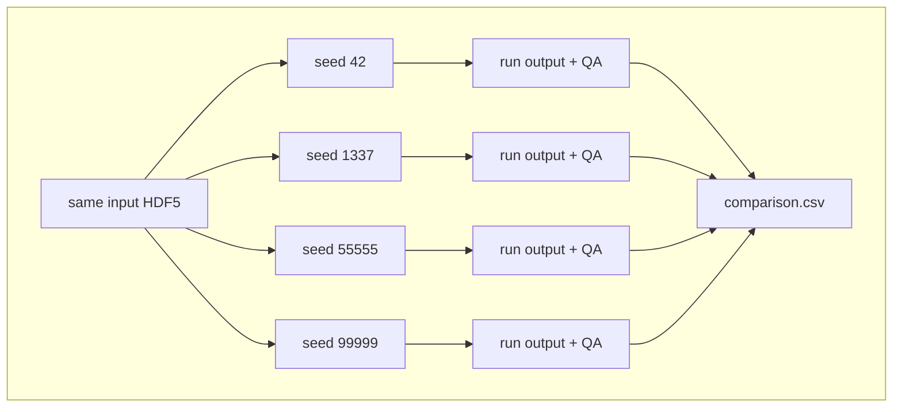
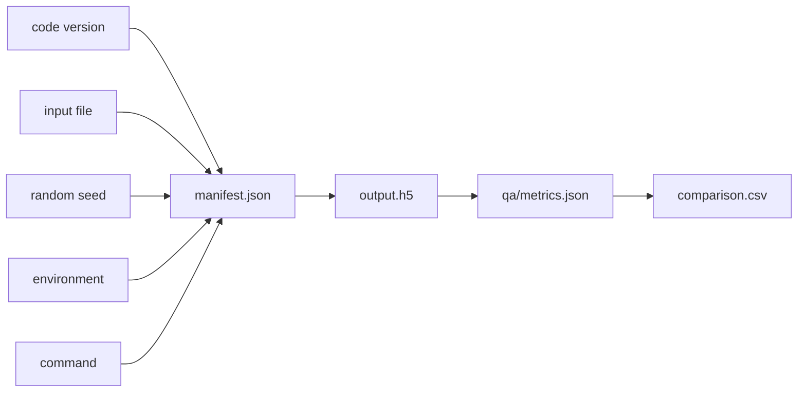
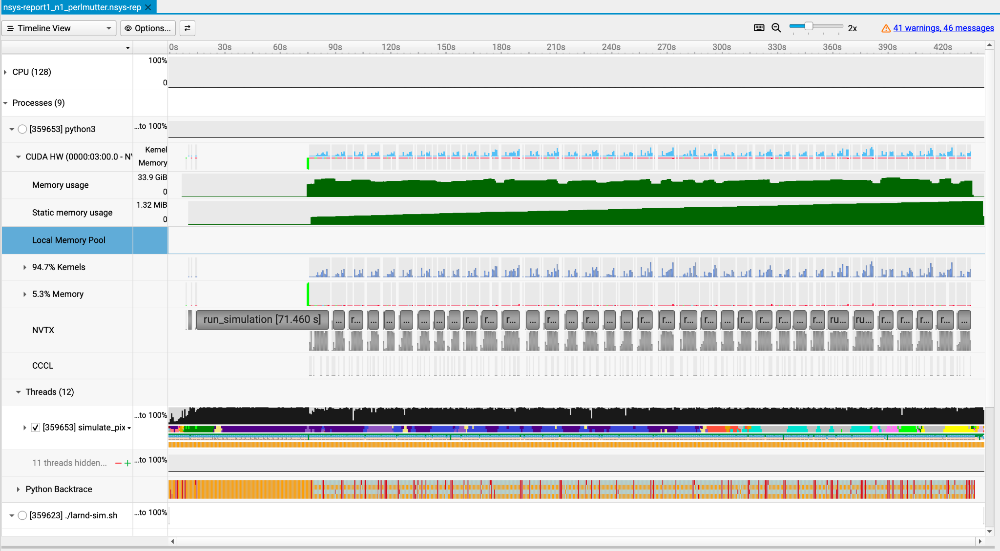

# Project 3: Parameter sweeps, provenance tracking, and first profiling

Day 3 expands the workflow from a single run into a controlled set of variants. Four runs are executed using the same pipeline, each with a different random seed from `configs/sweep.yaml`. Because the simulation has stochastic components, each variant will produce slightly different outputs — different packet counts, ADC distributions, and light yields. Each run is packaged with provenance information such as the seed used, environment settings, and code version. After completing the sweep, you will profile one run with NVIDIA Nsight Systems to get a first look at where the simulation spends time on the GPU.

## What you will learn

- How to run a controlled multi-variant parameter sweep.
- How random seeds affect stochastic simulation outputs.
- How to inspect run manifests for reproducibility metadata.
- How to compare sweep QA metrics and save a comparison CSV.
- How to run a first simple profiling run with NVIDIA Nsight Systems.
- How to inspect a profiling summary and recognize where the simulation spends time.

> **Note:** Each variant in `configs/sweep.yaml` uses an explicitly different random seed (42, 1337, 55555, 99999), so participants will see clear differences in packet counts and ADC distributions across the four runs in `comparison.csv`.

## Big picture

On Day 2 you created one baseline output. Today you are going to run the same workflow multiple times with controlled changes. This is the beginning of systematic computational science: change one thing at a time, record how the run was made, and compare outputs in a structured table.



## Key terms

- **Parameter sweep:** running the same workflow multiple times while changing one or more controlled settings.
- **Variant:** one member of the sweep, such as `seed_42` or `seed_1337`.
- **Random seed:** a number used to initialize stochastic parts of a simulation. If the code and environment are stable, recording the seed helps make a run easier to reproduce.
- **Stochastic simulation:** a simulation with random components. Two valid runs can differ slightly because random choices affect details such as packet counts or signal distributions.
- **Provenance:** the record of where a result came from: input file, code version, command, configuration, seed, environment variables, and output path.
- **Manifest:** the JSON file written for each run that stores provenance information.
- **CSV comparison table:** a simple spreadsheet-like file where each row is one run variant and each column is a metric or setting.

## Why reproducibility matters in HPC

HPC results often depend on many moving pieces: input files, source code, software versions, scheduler settings, environment variables, GPU hardware, random seeds, and run commands. Without provenance, it is hard to explain why two outputs differ. With provenance, you can answer practical questions:

- Which seed produced this output?
- Which input file was used?
- Which `larnd-sim` commit was installed?
- Was the same configuration used for every variant?
- Did a run fail because of the simulation, the environment, or the scheduler?

## Reproducibility chain

Each sweep run should be traceable from input to output.



## What the sweep does in this project

The file [`configs/sweep.yaml`](configs/sweep.yaml) defines four variants:

| Variant | Seed |
| --- | --- |
| `seed_42` | `42` |
| `seed_1337` | `1337` |
| `seed_55555` | `55555` |
| `seed_99999` | `99999` |

The simulation input and configuration stay the same. The random seed changes. After each variant, `sim2spec` runs QA and writes metrics so the variants can be compared.

## Resources

- [NERSC Documentation](https://docs.nersc.gov/)
- [DUNE larnd-sim documentation](https://dune.github.io/larnd-sim/larndsim.html)
- [DUNE/larnd-sim GitHub repository](https://github.com/DUNE/larnd-sim)
- [Python `csv` module documentation](https://docs.python.org/3/library/csv.html)
- [Python `json` module documentation](https://docs.python.org/3/library/json.html)
- [YAML specification](https://github.com/yaml/yaml-spec/)
- [NVIDIA Nsight Systems — Get Started](https://developer.nvidia.com/nsight-systems/get-started)

## Exercise

```bash
# Run a sweep
export WORKDIR=$PSCRATCH/HPC_intro/sim2spec
export LARNDSIM_DIR=$WORKDIR/larnd-sim
export INPUT_H5=$WORKDIR/input/MiniRun5_1E19_RHC.convert2h5.0000123.EDEPSIM.hdf5
export HDF5_USE_FILE_LOCKING=0
export LARNDSIM_DISABLE_CUPY_MEMPOOL=1
export OUTBASE=$WORKDIR/runs

cd $WORKDIR
pwd
```

```bash
# Validate the Python environment and the main dependencies
source setup.sh
source "$venv_name/bin/activate"
```

```bash
# NOTE: You will need a NERSC compute allocation and access to Perlmutter.
# For GPU work, request an interactive node or submit a batch job before running simulations.
salloc -C gpu -q interactive -t 00:30:00 -A <your_account> --gpus=1 --ntasks=1 --cpus-per-task=8
```

```bash
# Run simulation workflow
sim2spec sweep \
  --larndsim-dir "$LARNDSIM_DIR" \
  --config 2x2 \
  --input "$INPUT_H5" \
  --outdir "$OUTBASE/day3_sweep" \
  --sweep "$WORKDIR/configs/sweep.yaml" \
  --n-events 3
```

> **Alternatively:** Use [sim2spec_perlmutter_bootcamp.ipynb](JNotebook/sim2spec_perlmutter_bootcamp.ipynb), the interactive notebook for participants who prefer to complete the exercises in Jupyter instead of the terminal. Find the corresponding Project 3 (Day 3) section in the Jupyter notebook.
>
> **Extended/optional:** If you prefer to submit the sweep as a batch job instead of running it interactively, you can use the provided sbatch script. Make sure to replace `<your_account>` with your NERSC project account, then submit with:
>
> ```bash
> sbatch scripts/sbatch_day3_sweep.sh
> ```
>
> Outputs will be written to `$OUTBASE/day3_sweep_sbatch/` and job logs will appear as `day3_sweep_<jobid>.out` / `.err` in the directory where you submitted the job. Update the root path in the comparison scripts below accordingly.

> **Warning for reruns:** `larnd-sim` will not overwrite an existing `output.h5`. If you rerun the sweep with the same `--outdir` and see an error like `Output file ... already exists`, remove the old variant outputs first or choose a new output directory:
>
> ```bash
> rm "$OUTBASE"/day3_sweep/*/output.h5
> ```

```bash
# Inspect run directories
ls "$OUTBASE/day3_sweep"
find "$OUTBASE/day3_sweep" -maxdepth 2 -name manifest.json
find "$OUTBASE/day3_sweep" -maxdepth 3 -name metrics.json
```

```bash
# Compare variant metrics
python scripts/compare_sweep_metrics.py
```

```bash
# Extract provenance from manifests
python scripts/extract_sweep_provenance.py
```

```bash
# Save comparison CSV
python scripts/save_sweep_comparison_csv.py
```

```bash
# Inspect the comparison CSV
cat "$OUTBASE/day3_sweep/comparison.csv"
```

### Example output

Your absolute path, node name, commit hash, and exact metrics may differ, but a successful sweep should look similar to this.

```text
# Inspect run directories
<compute-node>:sim2spec > ls "$OUTBASE/day3_sweep"
000_seed_42  001_seed_1337  002_seed_55555  003_seed_99999
```

```text
<compute-node>:sim2spec > find "$OUTBASE/day3_sweep" -maxdepth 2 -name manifest.json
$OUTBASE/day3_sweep/000_seed_42/manifest.json
$OUTBASE/day3_sweep/001_seed_1337/manifest.json
$OUTBASE/day3_sweep/002_seed_55555/manifest.json
$OUTBASE/day3_sweep/003_seed_99999/manifest.json
```

```text
<compute-node>:sim2spec > find "$OUTBASE/day3_sweep" -maxdepth 3 -name metrics.json
$OUTBASE/day3_sweep/000_seed_42/qa/metrics.json
$OUTBASE/day3_sweep/001_seed_1337/qa/metrics.json
$OUTBASE/day3_sweep/002_seed_55555/qa/metrics.json
$OUTBASE/day3_sweep/003_seed_99999/qa/metrics.json
```

```text
# Compare variant metrics
<compute-node>:sim2spec > python scripts/compare_sweep_metrics.py
{'variant': '000_seed_42', 'n_packets': 4993, 'adc_mean': 23.47987182054877, 'adc_std': 25.17762346283151, 'n_light_wvfm': 3}
{'variant': '001_seed_1337', 'n_packets': 4986, 'adc_mean': 23.48395507420778, 'adc_std': 25.196210440038314, 'n_light_wvfm': 3}
{'variant': '002_seed_55555', 'n_packets': 5162, 'adc_mean': 23.307826423866718, 'adc_std': 25.03137846286839, 'n_light_wvfm': 3}
{'variant': '003_seed_99999', 'n_packets': 5033, 'adc_mean': 23.42837273991655, 'adc_std': 25.181188944302583, 'n_light_wvfm': 3}
```

```text
# Extract provenance from manifests
<compute-node>:sim2spec > python scripts/extract_sweep_provenance.py
RUN: 000_seed_42
  config: 2x2
  seed: 42
  n_events: 3
  git_commit: <larnd-sim commit>
  env: {}
  patch: {}
RUN: 001_seed_1337
  config: 2x2
  seed: 1337
  n_events: 3
  git_commit: <larnd-sim commit>
  env: {}
  patch: {}
RUN: 002_seed_55555
  config: 2x2
  seed: 55555
  n_events: 3
  git_commit: <larnd-sim commit>
  env: {}
  patch: {}
RUN: 003_seed_99999
  config: 2x2
  seed: 99999
  n_events: 3
  git_commit: <larnd-sim commit>
  env: {}
  patch: {}
```

```text
# Save comparison CSV
<compute-node>:sim2spec > python scripts/save_sweep_comparison_csv.py
Saved: $OUTBASE/day3_sweep/comparison.csv
```

```text
<compute-node>:sim2spec > cat "$OUTBASE/day3_sweep/comparison.csv"
variant,config,seed,n_events,git_commit,patch,n_packets,adc_mean,adc_std,n_light_wvfm
000_seed_42,2x2,42,3,<larnd-sim commit>,{},4993,23.47987182054877,25.17762346283151,3
001_seed_1337,2x2,1337,3,<larnd-sim commit>,{},4986,23.48395507420778,25.196210440038314,3
002_seed_55555,2x2,55555,3,<larnd-sim commit>,{},5162,23.307826423866718,25.03137846286839,3
003_seed_99999,2x2,99999,3,<larnd-sim commit>,{},5033,23.42837273991655,25.181188944302583,3
```

### What to compare and analyze

- packet counts across variants
- ADC mean and spread across variants
- whether any run is unexpectedly empty
- whether provenance is recorded consistently

### What to show

- directory tree with multiple runs
- one `manifest.json`
- `comparison.csv`

---

## Profiling run with Nsight Systems

After completing the sweep, profile one run with NVIDIA Nsight Systems to see where the simulation spends time on the GPU.

### What profiling adds

Running with `--profiler nsys` wraps the simulation in NVIDIA Nsight Systems. It records a timeline of CPU and GPU activity — when kernels launch, how long they run, and when memory is being used. The result is a `.nsys-rep` report file and a JSON summary you can inspect on the command line.

```bash
# Profile the run with default settings (TPB = 4)
sim2spec run \
  --larndsim-dir "$LARNDSIM_DIR" \
  --config 2x2 \
  --input "$INPUT_H5" \
  --outdir "$OUTBASE/day3_profile_baseline" \
  --n-events 5 \
  --profiler nsys
```

```bash
# Write the profile summary
sim2spec profile --run-dir "$OUTBASE/day3_profile_baseline/run"

# Inspect the profiling artifacts
ls "$OUTBASE/day3_profile_baseline/run"
cat "$OUTBASE/day3_profile_baseline/run/profile/nsys_stats.json" | head -n 30
```

> **Extended/optional:** If you prefer to submit the profiling run as a batch job, you can use the provided sbatch script. Make sure to replace `<your_account>` with your NERSC project account, then submit with:
>
> ```bash
> sbatch scripts/sbatch_day3_profile_baseline.sh
> ```

### What to look for

- Does `nsys_report.nsys-rep` appear in the run directory?
- Does `profile/nsys_stats.json` contain timing information?
- How long did the profiled run take? This is your reference wall time for Day 4.

### Nsight Systems GUI

To view the full interactive timeline, install NVIDIA Nsight Systems on your laptop, download the `.nsys-rep` file from Perlmutter, and open it locally. Install it today so it is ready for Day 4's comparison.

[NVIDIA Nsight Systems — Get Started](https://developer.nvidia.com/nsight-systems/get-started)

---

## Profiling key terms

- **Profiling:** measuring a program while it runs so you can identify where time and resources are spent.
- **Wall time:** the real elapsed time that a user waits for a command or job to finish.
- **GPU time:** time spent executing GPU kernels or GPU-related memory operations.
- **Kernel:** a function launched to run many small pieces of work in parallel on the GPU.
- **Memory transfer:** movement of data between CPU memory, GPU memory, or different GPU memory regions.
- **GPU occupancy:** a rough measure of how much of the GPU's execution capacity is active. Higher occupancy can help, but it is not automatically better for every kernel.
- **Nsight Systems:** an NVIDIA timeline profiler for understanding CPU/GPU scheduling and runtime behavior.
- **Nsight Compute (`ncu`):** an NVIDIA kernel profiler that gives detailed metrics for individual GPU kernels — duration, memory throughput, compute throughput, and occupancy.
- **TPB:** threads per block, a CUDA launch setting that controls how GPU work is grouped.
- **`.nsys-rep`:** the Nsight Systems report file produced by a profiling run. It can be opened in the Nsight Systems GUI on your laptop for an interactive timeline view.
- **`get_adc_values`:** a GPU kernel in `larnd-sim` that converts raw charge deposits into ADC values for each pixel.
- **`tracks_current_mc`:** a GPU kernel in `larnd-sim` that computes the induced current from particle tracks on the pixel readout plane.

---

## Nsight Systems timeline view

NVIDIA Nsight Systems shows a timeline of CPU activity, GPU kernels, memory behavior, and annotated application regions. This view is useful for seeing whether the GPU is busy, whether there are long gaps, and how repeated kernels are arranged over time.



Source: example Nsight Systems timeline screenshot from this project workflow.

---

### Achieved by end of Day

- multiple controlled runs are executed
- run metadata is captured
- outputs can be compared systematically
- profiling run (TPB = 4) is complete
- `.nsys-rep` report and `nsys_stats.json` are saved
- Nsight Systems GUI is downloaded and ready for Day 4
