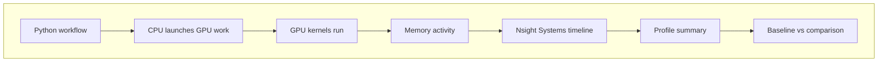
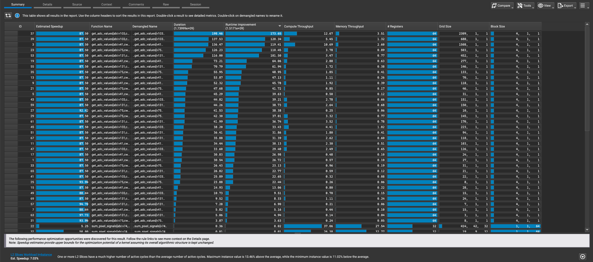

# Project 4: One measurable improvement and kernel profiling with Nsight Compute

On Day 3 you ran a first profiling run with Nsight Systems and got a high-level view of the simulation timeline. Day 4 builds on that. The goal is to make one concrete, measurable code change, verify that it actually changes performance, and then go deeper with NVIDIA Nsight Compute to examine two specific GPU kernels — `get_adc_values` and `tracks_current_mc` — that are known to take significant time.

## What you will learn

- How to apply a GPU execution change (Threads Per Block) and measure its effect.
- How to compare a baseline profile against a modified comparison run.
- How to document one measurable performance or reproducibility improvement.
- How to use NVIDIA Nsight Compute to profile specific GPU kernels.
- How to read Nsight Compute output for `get_adc_values` and `tracks_current_mc`.

## Big picture

Profiling means measuring where a program spends time and resources. On Day 4, you run the same simulation workflow under NVIDIA profiling tools so you can see when the CPU is launching work, when GPU kernels are running, when memory is being used, and whether a small code change changes the measured behavior.



## Nsight Systems timeline view

NVIDIA Nsight Systems shows a timeline of CPU activity, GPU kernels, memory behavior, and annotated application regions. This view is useful for seeing whether the GPU is busy, whether there are long gaps, and how repeated kernels are arranged over time.


Source: example Nsight Systems timeline screenshot from this project workflow.

<!--
## Nsight Compute summary view

NVIDIA Nsight Compute gives more detailed kernel-level information. It is useful when you want to look beyond the timeline and ask which CUDA kernels dominate runtime, how much compute or memory throughput they use, and what launch configuration was used.



Source: example Nsight Compute summary screenshot from this project workflow.
-->

## Key terms

- **Profiling:** measuring a program while it runs so you can identify where time and resources are spent.
- **Wall time:** the real elapsed time that a user waits for a command or job to finish.
- **GPU time:** time spent executing GPU kernels or GPU-related memory operations.
- **Kernel:** a function launched to run many small pieces of work in parallel on the GPU.
- **Memory transfer:** movement of data between CPU memory, GPU memory, or different GPU memory regions.
- **GPU occupancy:** a rough measure of how much of the GPU's execution capacity is active. Higher occupancy can help, but it is not automatically better for every kernel.
- **Nsight Systems:** an NVIDIA timeline profiler for understanding CPU/GPU scheduling and runtime behavior.
- **Nsight Compute (`ncu`):** an NVIDIA kernel profiler that gives detailed metrics for individual GPU kernels — duration, memory throughput, compute throughput, and occupancy.
- **TPB:** threads per block, a CUDA launch setting that controls how GPU work is grouped.
- **`get_adc_values`:** a GPU kernel in `larnd-sim` that converts raw charge deposits into ADC values for each pixel.
- **`tracks_current_mc`:** a GPU kernel in `larnd-sim` that computes the induced current from particle tracks on the pixel readout plane.

## Why Threads Per Block (TPB) can affect performance

Changing `TPB` changes how work is divided into GPU thread blocks. That can affect occupancy, register use, scheduling overhead, memory access patterns, and the number of blocks launched. A larger `TPB` is not guaranteed to be faster, so the important lesson is to measure the baseline and comparison runs instead of guessing.

## Performance vs reproducibility improvement

| Improvement type | What it means | Example evidence |
| --- | --- | --- |
| Performance improvement | The same scientific workflow runs faster or uses resources more efficiently. | Lower wall time, shorter GPU kernel time, fewer long idle gaps, or smaller memory overhead. |
| Reproducibility improvement | The same workflow becomes easier to rerun, compare, and explain. | Better manifests, captured GPU/system information, recorded commands, fixed seeds, or clearer output organization. |

## What to look for

### In the Nsight Systems comparison

- Does the comparison run change wall time or output size relative to the baseline?
- Does the GPU timeline show long idle gaps or repeated kernels?
- Are memory transfers or memory allocation patterns visible?
- Is there enough provenance to explain how each profiled run was produced?

### In the Nsight Compute kernel report

- How long does each kernel (`get_adc_values`, `tracks_current_mc`) take to run?
- Is the kernel memory-bound (high memory throughput, low compute throughput) or compute-bound (the opposite)?
- What is the kernel occupancy — how much of the GPU's execution capacity is being used?
- Do the two kernels behave differently from each other?

## Resources

- [NVIDIA Nsight Systems — Get Started](https://developer.nvidia.com/nsight-systems/get-started)
- [NVIDIA Nsight Compute — Get Started](https://developer.nvidia.com/tools-overview/nsight-compute/get-started)
- [CUDA documentation](https://docs.nvidia.com/cuda/)
- [Numba documentation](https://numba.readthedocs.io/)
- [CuPy documentation](https://docs.cupy.dev/)

## Exercise

```bash
# Profile the baseline run with nsys
export WORKDIR=$PSCRATCH/HPC_intro/sim2spec
export LARNDSIM_DIR=$WORKDIR/larnd-sim
export INPUT_H5=$WORKDIR/input/MiniRun5_1E19_RHC.convert2h5.0000123.EDEPSIM.hdf5
export HDF5_USE_FILE_LOCKING=0
export LARNDSIM_DISABLE_CUPY_MEMPOOL=1
export OUTBASE=$WORKDIR/runs

cd $WORKDIR
pwd
```

```bash
# Validate the Python environment and the main dependencies
source setup.sh
source "$venv_name/bin/activate"
```

```bash
# NOTE: You will need a NERSC compute allocation and access to Perlmutter.
# For GPU work, request an interactive node or submit a batch job before running simulations.
salloc -C gpu -q interactive -t 00:30:00 -A <your_account> --gpus=1 --ntasks=1 --cpus-per-task=8
```

```bash
# run simulation workflow
sim2spec run \
  --larndsim-dir "$LARNDSIM_DIR" \
  --config 2x2 \
  --input "$INPUT_H5" \
  --outdir "$OUTBASE/day4_profile_baseline" \
  --n-events 5 \
  --profiler nsys
```

> **Alternatively:** Use [sim2spec_perlmutter_bootcamp.ipynb](JNotebook/sim2spec_perlmutter_bootcamp.ipynb), the interactive notebook for participants who prefer to complete the exercises in Jupyter instead of the terminal. Find the corresponding Project 4 (Day 4) section in the Jupyter notebook.
>
> **Extended/optional:** If you prefer to submit the baseline profile run as a batch job, you can use the provided sbatch script. Make sure to replace `<your_account>` with your NERSC project account, then submit with:
>
> ```bash
> sbatch scripts/sbatch_day4_profile_baseline.sh
> ```
>
> Outputs will be written to `$OUTBASE/day4_profile_baseline_sbatch/run` and job logs will appear as `day4_profile_baseline_<jobid>.out` / `.err` in the directory where you submitted the job. The profile summary is generated automatically at the end of the script.

```bash

# Write profile summary
sim2spec profile --run-dir "$OUTBASE/day4_profile_baseline/run"

# Inspect profiling artifacts
ls "$OUTBASE/day4_profile_baseline/run"
cat "$OUTBASE/day4_profile_baseline/run/profile/nsys_stats.json" | head -n 40
```

### Profile one comparison run

For the comparison profiling case, participants should modify the CUDA thread-block setting in the `larnd-sim` source before running the second profile. Open the file `larnd-sim/cli/simulate_pixels.py` (available in your working directory after running `install.sh`) and search for the setting:

```bash
TPB = 4
```
Change it to:

```bash
TPB = 64
```
Then rerun the profiling command for the comparison case. This gives a simple example of how changing a GPU execution parameter can affect runtime behavior and profiling results.

> **Alternatively:** Use [sim2spec_perlmutter_bootcamp.ipynb](JNotebook/sim2spec_perlmutter_bootcamp.ipynb), the interactive notebook for participants who prefer to complete the exercises in Jupyter instead of the terminal. Find the corresponding Project 4 (Day 4) section in the Jupyter notebook.
>
> **Extended/optional:** If you prefer to submit the comparison profile run as a batch job, make sure you have applied the TPB change above first, then submit with:
>
> ```bash
> sbatch scripts/sbatch_day4_profile_compare.sh
> ```
>
> Outputs will be written to `$OUTBASE/day4_profile_compare_sbatch/run` and job logs will appear as `day4_profile_compare_<jobid>.out` / `.err` in the directory where you submitted the job. The profile summary is generated automatically at the end of the script.

> **Warning for reruns:** `larnd-sim` will not overwrite an existing `output.h5`. If you rerun the comparison profile with the same `--outdir` and see an error like `Output file ... already exists`, remove the old output file first or choose a new output directory:
>
> ```bash
> rm "$OUTBASE/day4_profile_compare/run/output.h5"
> ```

```bash

sim2spec run \
  --larndsim-dir "$LARNDSIM_DIR" \
  --config 2x2 \
  --input "$INPUT_H5" \
  --outdir "$OUTBASE/day4_profile_compare" \
  --n-events 5 \
  --profiler nsys
```

```bash
# Write profile summary
sim2spec profile --run-dir "$OUTBASE/day4_profile_compare/run"
```

```bash
# Compare approximate wall time and output file size using file timestamps
python scripts/compare_profile_runs.py
```

---

## Kernel profiling with Nsight Compute

Nsight Systems gives you a timeline view. Nsight Compute goes one level deeper: it profiles individual GPU kernels and tells you how efficiently each one uses the GPU's compute and memory resources.

Two kernels in `larnd-sim` are known to dominate runtime:

- **`get_adc_values`** — converts charge deposits into ADC values for each pixel.
- **`tracks_current_mc`** — computes the induced current from particle tracks on the pixel readout plane.

Run the profiler targeting only these two kernels. Use `--n_events 1` to keep the run short — Nsight Compute slows execution significantly while collecting detailed metrics.

```bash
export NCU_OUTDIR="$OUTBASE/day4_ncu"
mkdir -p "$NCU_OUTDIR"

ncu \
  --kernel-name "get_adc_values|tracks_current_mc" \
  --launch-count 1 \
  --set full \
  --force-overwrite \
  -o "$NCU_OUTDIR/ncu_report" \
  python3 "$LARNDSIM_DIR/cli/simulate_pixels.py" \
    2x2 \
    --input_filename "$INPUT_H5" \
    --output_filename "$NCU_OUTDIR/output.h5" \
    --rand_seed 321 \
    --n_events 1
```

```bash
# Print a per-kernel summary on the command line
ncu --import "$NCU_OUTDIR/ncu_report.ncu-rep" --print-summary per-kernel
```

### What to look at in the Nsight Compute output

| Metric | What it tells you |
| --- | --- |
| Duration | How long the kernel ran in total. |
| Memory throughput | How fast data moved in and out of GPU memory. High = memory-bound. |
| Compute throughput | How hard the GPU's math units were working. High = compute-bound. |
| Occupancy | How much of the GPU's execution capacity was active. |

### Nsight Compute GUI

To explore the full kernel report interactively, install Nsight Compute on your laptop, download the `.ncu-rep` file from Perlmutter, and open it locally. The GUI shows the roofline chart, memory access patterns, and warp stall reasons in detail.

[NVIDIA Nsight Compute — Get Started](https://developer.nvidia.com/tools-overview/nsight-compute/get-started)

---

### Example output

Your exact times may differ depending on queue placement, node state, software version, and system load. A successful baseline-versus-comparison summary should look similar to this:

```text
=== Run-level comparison ===

day4_profile_baseline
  approx_wall_seconds: 110.0
  output_size_MB: 34.16

day4_profile_compare
  approx_wall_seconds: 100.0
  output_size_MB: 34.16
```

```bash

# Optional reproducibility improvement: record GPU information
mkdir -p "$OUTBASE/day4_profile_baseline/run/system_info"
mkdir -p "$OUTBASE/day4_profile_compare/run/system_info"

nvidia-smi -L | tee "$OUTBASE/day4_profile_baseline/run/system_info/gpu_list.txt"
nvidia-smi -L | tee "$OUTBASE/day4_profile_compare/run/system_info/gpu_list.txt"
```

### What to compare and analyze

- approximate baseline versus comparison runtime from `compare_profile_runs.py`
- output file size for the baseline and comparison runs
- whether the TPB change affected performance behavior
- duration and throughput of `get_adc_values` and `tracks_current_mc` from Nsight Compute
- whether the two kernels are memory-bound or compute-bound

### What to show

- `nsys_report*.nsys-rep` and `profile/nsys_stats.json`
- a small comparison summary: `approx_wall_seconds` and `output_size_MB`
- `day4_ncu/ncu_report.ncu-rep` and the per-kernel summary
- optional `system_info/` files

### Achieved by end of Day

- baseline and comparison runs measured side by side
- one measurable code change (TPB) evaluated and documented
- `get_adc_values` and `tracks_current_mc` profiled with Nsight Compute
- kernel duration, memory throughput, and occupancy recorded

### Before you go

**Nsight Systems GUI:** install on your laptop, download the `.nsys-rep` file from Perlmutter, and open it locally. Profiling reports are at:

- `runs/day4_profile_baseline/run/nsys_report.nsys-rep`
- `runs/day4_profile_compare/run/nsys_report.nsys-rep`

[NVIDIA Nsight Systems — Get Started](https://developer.nvidia.com/nsight-systems/get-started)

**Nsight Compute GUI:** install on your laptop, download the `.ncu-rep` file from Perlmutter, and open it locally. The kernel report is at:

- `runs/day4_ncu/ncu_report.ncu-rep`

[NVIDIA Nsight Compute — Get Started](https://developer.nvidia.com/tools-overview/nsight-compute/get-started)
