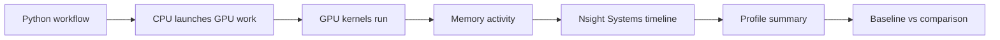

# Project 4: Profiling and one measurable improvement

Day 4 adds observability and performance analysis to the workflow. Instead of just running the simulation, the goal is to understand how it behaves on the GPU and where time is being spent. Profiling a baseline run and one comparison run provides evidence that can support either a performance improvement or a reproducibility improvement. The goal is not deep kernel optimization, but to demonstrate that the workflow can be measured, compared, and improved in a disciplined way.

## What you will learn

- How to profile a `larnd-sim` workflow with NVIDIA Nsight Systems.
- How to generate and inspect `nsys` profile summaries.
- How to compare a baseline profile against a modified comparison run.
- How to document one measurable performance or reproducibility improvement.

## Big picture

Profiling means measuring where a program spends time and resources. On Day 4, you run the same simulation workflow under NVIDIA profiling tools so you can see when the CPU is launching work, when GPU kernels are running, when memory is being used, and whether a small code change changes the measured behavior.



## Nsight Systems timeline view

NVIDIA Nsight Systems shows a timeline of CPU activity, GPU kernels, memory behavior, and annotated application regions. This view is useful for seeing whether the GPU is busy, whether there are long gaps, and how repeated kernels are arranged over time.


Source: example Nsight Systems timeline screenshot from this project workflow.

<!--
## Nsight Compute summary view

NVIDIA Nsight Compute gives more detailed kernel-level information. It is useful when you want to look beyond the timeline and ask which CUDA kernels dominate runtime, how much compute or memory throughput they use, and what launch configuration was used.


Source: example Nsight Compute summary screenshot from this project workflow.
-->

## Key terms

- **Profiling:** measuring a program while it runs so you can identify where time and resources are spent.
- **Wall time:** the real elapsed time that a user waits for a command or job to finish.
- **GPU time:** time spent executing GPU kernels or GPU-related memory operations.
- **Kernel:** a function launched to run many small pieces of work in parallel on the GPU.
- **Memory transfer:** movement of data between CPU memory, GPU memory, or different GPU memory regions.
- **GPU occupancy:** a rough measure of how much of the GPU's execution capacity is active. Higher occupancy can help, but it is not automatically better for every kernel.
- **Nsight Systems:** an NVIDIA timeline profiler for understanding CPU/GPU scheduling and runtime behavior.
- **TPB:** threads per block, a CUDA launch setting that controls how GPU work is grouped.
  <!-- - **Nsight Compute:** an NVIDIA kernel profiler for detailed CUDA kernel metrics. -->

## Why TPB can affect performance

Changing `TPB` changes how work is divided into GPU thread blocks. That can affect occupancy, register use, scheduling overhead, memory access patterns, and the number of blocks launched. A larger `TPB` is not guaranteed to be faster, so the important lesson is to measure the baseline and comparison runs instead of guessing.

## Performance vs reproducibility improvement

| Improvement type | What it means | Example evidence |
| --- | --- | --- |
| Performance improvement | The same scientific workflow runs faster or uses resources more efficiently. | Lower wall time, shorter GPU kernel time, fewer long idle gaps, or smaller memory overhead. |
| Reproducibility improvement | The same workflow becomes easier to rerun, compare, and explain. | Better manifests, captured GPU/system information, recorded commands, fixed seeds, or clearer output organization. |

## What to look for in the profile

- Did the `.nsys-rep` report and `profile/nsys_stats.json` file get created?
- Does the GPU timeline show long idle gaps or repeated kernels?
- Are memory transfers or memory allocation patterns visible?
- Does the comparison run change wall time or output size?
- Is there enough provenance to explain how each profiled run was produced?

## Resources

- [NVIDIA Nsight Systems](https://developer.nvidia.com/nsight-systems/get-started)
- [CUDA documentation](https://docs.nvidia.com/cuda/)
- [Numba documentation](https://numba.readthedocs.io/)
- [CuPy documentation](https://docs.cupy.dev/)
<!-- - [NVIDIA Nsight Compute](https://developer.nvidia.com/nsight-compute) -->

## Exercise

```bash
# Profile the baseline run with nsys
export WORKDIR=$PSCRATCH/HPC_intro/sim2spec
export LARNDSIM_DIR=$WORKDIR/larnd-sim
export INPUT_H5=$WORKDIR/input/MiniRun5_1E19_RHC.convert2h5.0000123.EDEPSIM.hdf5
export HDF5_USE_FILE_LOCKING=0
export LARNDSIM_DISABLE_CUPY_MEMPOOL=1
export OUTBASE=$WORKDIR/runs

cd $WORKDIR
pwd
```

```bash
# Validate the Python environment and the main dependencies
source setup.sh
source "$venv_name/bin/activate"
```

```bash
# NOTE: You will need a NERSC compute allocation and access to Perlmutter.
# For GPU work, request an interactive node or submit a batch job before running simulations.
salloc -C gpu -q interactive -t 00:30:00 -A <your_account> --gpus=1 --ntasks=1 --cpus-per-task=8
```

```bash
# run simulation workflow
sim2spec run \
  --larndsim-dir "$LARNDSIM_DIR" \
  --config 2x2 \
  --input "$INPUT_H5" \
  --outdir "$OUTBASE/day4_profile_baseline" \
  --n-events 5 \
  --profiler nsys
```

> **Alternatively**, if you prefer to submit the baseline profile run as a batch job, you can use the provided sbatch script. Make sure to replace `<your_account>` with your NERSC project account, then submit with:
>
> ```bash
> sbatch scripts/sbatch_day4_profile_baseline.sh
> ```
>
> Outputs will be written to `$OUTBASE/day4_profile_baseline_sbatch/run` and job logs will appear as `day4_profile_baseline_<jobid>.out` / `.err` in the directory where you submitted the job. The profile summary is generated automatically at the end of the script.

```bash

# Write profile summary
sim2spec profile --run-dir "$OUTBASE/day4_profile_baseline/run"

# Inspect profiling artifacts
ls "$OUTBASE/day4_profile_baseline/run"
cat "$OUTBASE/day4_profile_baseline/run/profile/nsys_stats.json" | head -n 40
```

### Profile one comparison run

For the comparison profiling case, participants should modify the CUDA thread-block setting in the `larnd-sim` source before running the second profile. Open the file [`larnd-sim/cli/simulate_pixels.py`](larnd-sim/cli/simulate_pixels.py) and search for the setting:

```bash
TPB = 4
```
Change it to:

```bash
TPB = 64
```
Then rerun the profiling command for the comparison case. This gives a simple example of how changing a GPU execution parameter can affect runtime behavior and profiling results.

> **Alternatively**, if you prefer to submit the comparison profile run as a batch job, make sure you have applied the TPB change above first, then submit with:
>
> ```bash
> sbatch scripts/sbatch_day4_profile_compare.sh
> ```
>
> Outputs will be written to `$OUTBASE/day4_profile_compare_sbatch/run` and job logs will appear as `day4_profile_compare_<jobid>.out` / `.err` in the directory where you submitted the job. The profile summary is generated automatically at the end of the script.

> **Warning for reruns:** `larnd-sim` will not overwrite an existing `output.h5`. If you rerun the comparison profile with the same `--outdir` and see an error like `Output file ... already exists`, remove the old output file first or choose a new output directory:
>
> ```bash
> rm "$OUTBASE/day4_profile_compare/run/output.h5"
> ```

```bash

sim2spec run \
  --larndsim-dir "$LARNDSIM_DIR" \
  --config 2x2 \
  --input "$INPUT_H5" \
  --outdir "$OUTBASE/day4_profile_compare" \
  --n-events 5 \
  --profiler nsys
```

```bash
# Write profile summary
sim2spec profile --run-dir "$OUTBASE/day4_profile_compare/run"
```

```bash
# Compare approximate wall time and output file size using file timestamps

python - <<'PY'
import os

base = os.environ["OUTBASE"]
runs = ["day4_profile_baseline", "day4_profile_compare"]

print("=== Run-level comparison ===")
for name in runs:
    run = f"{base}/{name}/run"
    manifest = f"{run}/manifest.json"
    output = f"{run}/output.h5"

    print(f"\n{name}")

    if os.path.exists(manifest) and os.path.exists(output):
        mt_manifest = os.path.getmtime(manifest)
        mt_output = os.path.getmtime(output)
        print("  approx_wall_seconds:", round(mt_output - mt_manifest, 2))
        print("  output_size_MB:", round(os.path.getsize(output) / (1024 * 1024), 2))
    else:
        print("  missing manifest or output.h5")
PY
```

### Example output

Your exact times may differ depending on queue placement, node state, software version, and system load. A successful baseline-versus-comparison summary should look similar to this:

```text
=== Run-level comparison ===

day4_profile_baseline
  approx_wall_seconds: 110.0
  output_size_MB: 34.16

day4_profile_compare
  approx_wall_seconds: 100.0
  output_size_MB: 34.16
```

```bash

# Optional reproducibility improvement: record GPU information
mkdir -p "$OUTBASE/day4_profile_baseline/run/system_info"
mkdir -p "$OUTBASE/day4_profile_compare/run/system_info"

nvidia-smi -L | tee "$OUTBASE/day4_profile_baseline/run/system_info/gpu_list.txt"
nvidia-smi -L | tee "$OUTBASE/day4_profile_compare/run/system_info/gpu_list.txt"
```

### What to compare and analyze

- existence of profiling report files
- approximate baseline versus comparison runtime
- output file size for the baseline and comparison runs
- whether the code change or runtime setting affects performance behavior
- whether enough runtime environment information is captured for reproducibility

### What to show

- `nsys_report*.nsys-rep`
- `profile/nsys_stats.json`
- a small comparison summary such as:
  - `approx_wall_seconds`
  - `output_size_MB`
- optional `system_info/` files

### Achieved by end of Day

- the workflow is profiled
- baseline and comparison runs are measured side by side
- one practical code or workflow change is evaluated
- one performance or reproducibility improvement is documented

### Before you go

If you want the visual timeline view shown above, the easiest approach is usually to install NVIDIA Nsight Systems on your local laptop, download the `.nsys-rep` file from Perlmutter, and open it locally. The command-line `nsys stats` summary is useful on Perlmutter, but the local GUI is much easier for exploring the full timeline.

For this project, the profiling reports are expected at:

- `runs/day4_profile_baseline/run/nsys_report.nsys-rep`
- `runs/day4_profile_compare/run/nsys_report.nsys-rep`

NVIDIA Nsight Systems can be downloaded from [NVIDIA Nsight Systems - Get Started](https://developer.nvidia.com/nsight-systems/get-started).
