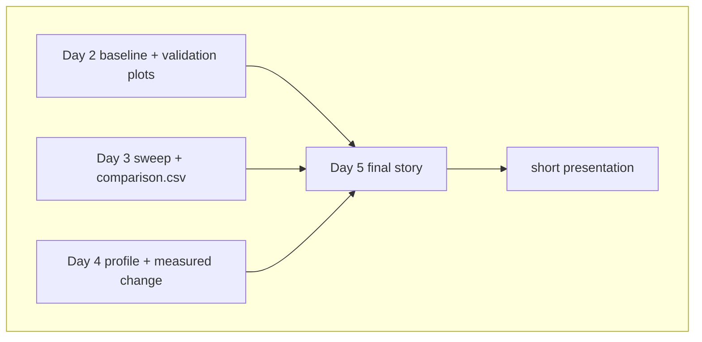

# Project 5: Final cross-day comparison and summary

Day 5 pulls together the most important outputs from the whole bootcamp: baseline results, sweep comparisons, validation plots, and profiling artifacts. The goal is to prepare a compact final summary that explains what ran, what changed across days, and what evidence supports the final presentation.

> **Alternatively:** Use [sim2spec_perlmutter_bootcamp.ipynb](JNotebook/sim2spec_perlmutter_bootcamp.ipynb), the interactive notebook for participants who prefer to complete the exercises in Jupyter instead of the terminal. Find the corresponding Project 5 (Day 5) section in the Jupyter notebook.

## What you will learn

- How to collect final baseline, sweep, validation, and profiling artifacts.
- How to compare baseline and sweep metrics across the project.
- How to identify the key evidence needed for the final presentation.
- How to summarize the full workflow into a compact cross-day result.

## Big picture

The final summary should tell one clear story: the baseline worked, the sweep explored controlled variation, the profiling step measured runtime behavior, and the final comparison explains what changed and what was learned.



## What makes a good final summary

A good final project summary is short, evidence-based, and reproducible. It should answer:

- What workflow did you run?
- What output files and plots did you create?
- What changed between the baseline, sweep, and profiling runs?
- What evidence supports your conclusion?
- What would you try next if you had more time?

## Evidence to collect

| Evidence | Where it comes from | Why it matters |
| --- | --- | --- |
| Baseline QA metrics | Day 2 `qa/metrics.json` | Shows that the reference run completed and produced interpretable output. |
| Validation plots | Day 2 plot files | Connects QA numbers to detector-output behavior. |
| Sweep comparison | Day 3 `comparison.csv` | Shows how controlled random seeds changed output metrics. |
| Run manifests | Day 2 and Day 3 `manifest.json` files | Records inputs, settings, seeds, and environment details. |
| Profiling summary | Day 4 `profile/nsys_stats.json` | Shows measured runtime behavior for baseline and comparison runs. |
| Final notes | Your presentation or summary slide | Explains what changed, what stayed stable, and what you learned. |

## Suggested presentation template

1. **Goal:** one sentence describing the simulation workflow.
2. **Baseline:** one QA metric and one validation plot from Day 2.
3. **Sweep:** one table or observation from Day 3.
4. **Profiling:** one measured comparison from Day 4.
5. **Takeaway:** what changed, what you learned, and one next step.

## Exercise

```bash
# Compare baseline vs sweep
export WORKDIR=$PSCRATCH/HPC_intro/sim2spec
export HDF5_USE_FILE_LOCKING=0
export OUTBASE=$WORKDIR/runs

source setup.sh
source "$venv_name/bin/activate"
```

```bash
python scripts/compare_baseline_vs_sweep.py
```

```bash
# Collect final presentation artifacts
find "$OUTBASE" -maxdepth 4 \( -name "metrics.json" -o -name "manifest.json" -o -name "*.png" -o -name "nsys_stats.json" \) | sort
```

## Final artifact checklist

- Day 2 baseline `metrics.json`
- Day 2 validation plots
- Day 3 `comparison.csv`
- one Day 3 `manifest.json`
- Day 4 `nsys_stats.json`
- one final slide or short summary explaining what changed and what you learned
